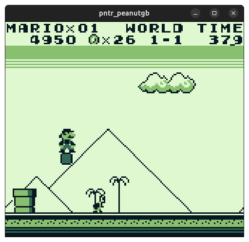

# pntr_peanutgb

[Peanut-GB](https://github.com/deltabeard/Peanut-GB) Game Boy emulator for [pntr](https://github.com/RobLoach/pntr).



## API

``` c
struct gb_s* pntr_load_peanutgb(const void* data);
void pntr_unload_peanutgb(struct gb_s* gb);
bool pntr_update_peanutgb(struct gb_s* gb);
void pntr_draw_peanutgb(pntr_image* dst, struct gb_s* gb, int posX, int posY);
void pntr_peanutgb_set_palette(struct gb_s* gb, pntr_color col1, pntr_color col2, pntr_color col3, pntr_color col4);
pntr_image* pntr_peanutgb_image(struct gb_s* gb);
void pntr_peanutgb_event(struct gb_s* gb, pntr_app_event* event);
```

## Build

```
cmake -B build -DSDL=true -DRAYLIB=true -DLIBRETRO=true -DCLI=true
cmake --build build
```

# License

[MIT](LICENSE)
